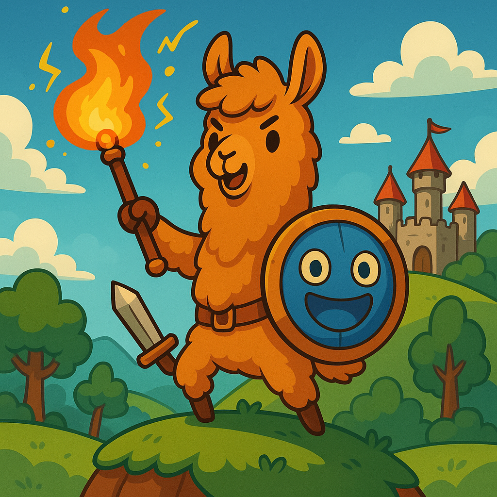

# 🦙 Llama Knight Adventure

A classic Zelda-style top-down adventure game featuring a brave llama knight exploring magical worlds, collecting equipment, and battling enemies with powerful magic spells.



## 🎮 Game Features

### Core Gameplay
- **Top-down exploration** in the style of classic Zelda games
- **Multi-room world system** with seamless room transitions
- **Equipment collection** including armor and magical weapons
- **Magic combat system** with chargeable fireballs and explosive spells
- **Mouse-aimed projectile system** for precise targeting
- **Persistent fire effects** that remain on tiles for strategic gameplay

### Advanced Features
- **Dynamic charging system** with visual feedback and staff effects
- **Inventory management** with hotkey weapon switching (1-3 keys)
- **Save/Load system** using browser localStorage
- **Professional pause menu** accessible with ESC key
- **Zoom controls** for better visibility (+ and - keys)
- **Title screen** with custom background and game options

### Visual & Audio
- **Pixel-perfect rendering** with crisp sprite graphics
- **Custom UI elements** with classic adventure game styling
- **Animated spell effects** including fire tiles and explosions
- **Professional title screen** with custom background image
- **Smooth camera system** that follows the player

## 🕹️ Controls

### Movement
- **WASD** - Move the llama knight in all directions

### Combat & Magic
- **Mouse** - Aim magical attacks
- **Left Click & Hold** - Charge up powerful fireball spells
- **Release Click** - Launch charged fireball (creates fire tiles and explosions)

### Inventory & Equipment
- **1** - No weapon (peaceful mode)
- **2** - Sword (melee combat)
- **3** - Magic Staff (ranged magic attacks)
- **I** - Toggle inventory display

### Game Management
- **ESC** - Pause game / Access pause menu
- **S** - Save game (when paused)
- **Q** - Quit to title screen (when paused)
- **ENTER/SPACE** - Start new game (from title screen)
- **L** - Load saved game (from title screen)

### Debug & View
- **F1** - Toggle debug mode
- **+/-** - Zoom in/out for better visibility

## 🚀 Getting Started

### Prerequisites
- Modern web browser (Chrome, Firefox, Safari, Edge)
- Local web server (for proper file loading)

### Installation & Running

1. **Clone or download** this repository to your local machine

2. **Choose your preferred method**:

   **Option A: VS Code Live Server (Recommended)**
   - Open the project in VS Code
   - Install the "Live Server" extension if you haven't already
   - Right-click on `llama-knight-adventure.html` and select "Open with Live Server"
   - The game will open in your browser automatically

   **Option B: Manual Local Server**
   ```bash
   # Using Python:
   python -m http.server 8000
   
   # Or with Node.js:
   npx http-server
   
   # Then open: http://localhost:8000/llama-knight-adventure.html
   ```

   **Option C: Deployed Web Version**
   - Upload the project to any web hosting service
   - Access directly via the web URL

3. **Enjoy the adventure!** 🎮

### Quick Start Guide
1. **Title Screen**: Use ENTER/SPACE to start a new game or L to load a saved game
2. **Explore**: Move with WASD to explore different rooms and collect items
3. **Combat**: Collect the magic staff and use mouse to aim, click and hold to charge powerful spells
4. **Equipment**: Pick up armor for protection and try different weapons with number keys
5. **Save Progress**: Press ESC to pause, then S to save your adventure

## 📁 Project Structure

```
llama-knight-adventure/
├── llama-knight-adventure.html # Main game HTML file
├── README.md               # This file - game documentation
├── featureRequest.md       # Feature ideas and roadmap
├── assets/
│   ├── images/
│   │   └── title-background.png  # Custom title screen background
│   ├── sprites/            # Game character and object sprites
│   │   ├── llama_knight.png
│   │   ├── llama_knight_armor.png
│   │   ├── magic_staff.png
│   │   └── ...
│   └── audio/             # Sound effects and music (future expansion)
└── js/
    └── zelda/             # Game engine modules
        ├── Game.js        # Main game controller and state management
        ├── Player.js      # Player character logic and rendering
        ├── GameMap.js     # World map, tiles, and room system
        ├── Inventory.js   # Item management and UI
        ├── Projectile.js  # Magic spells and combat projectiles
        └── SpriteLoader.js # Asset loading and management
```

## 🎯 Game Mechanics

### Magic System
- **Basic Fireballs**: Quick click-and-release for standard projectiles
- **Charged Spells**: Hold mouse button to charge for explosive fireballs
- **Fire Tiles**: Charged spells create persistent fire effects on impact tiles
- **Area Damage**: Explosive spells affect multiple tiles around the impact point

### Equipment System
- **Armor**: Provides protection and changes player appearance
- **Magic Staff**: Enables magical attacks with visual effects
- **Weapon Switching**: Use number keys to quickly change between equipment

### World & Progression
- **Room-based World**: Explore connected rooms with different layouts
- **Item Collection**: Find and collect equipment scattered throughout the world
- **Save System**: Progress is automatically saved and can be loaded later
- **Persistent Effects**: Fire tiles and other effects persist during gameplay

## 🛠️ Technical Details

### Built With
- **HTML5 Canvas** - 2D graphics rendering
- **JavaScript ES6** - Modern JavaScript with class-based architecture
- **Browser APIs** - localStorage for save games, mouse/keyboard events

### Architecture
- **Modular Design** - Separate classes for different game systems
- **State Management** - Clean separation between title, playing, and paused states
- **Event-Driven** - Responsive input handling and game events
- **Performance Optimized** - Efficient rendering and update loops

### Browser Compatibility
- Chrome 60+ ✅
- Firefox 55+ ✅
- Safari 12+ ✅
- Edge 79+ ✅

## 🐛 Troubleshooting

### Common Issues

**Green screen instead of game**
- Use VS Code Live Server extension for local development
- Or ensure you're accessing the game via a web server/hosting service
- Check browser console (F12) for any error messages
- Avoid opening the HTML file directly in the browser

**Sprites not loading**
- Verify all files in the `assets/sprites/` directory are present
- Ensure you're using Live Server or a web hosting service
- Check browser console (F12) for specific file loading errors

**Mouse aiming feels off**
- The game includes automatic camera and zoom compensation
- Try the + and - keys to adjust zoom level for comfort

**Save/Load not working**
- Make sure your browser allows localStorage
- Check that you're not in private/incognito mode

## 🎨 Customization

### Adding New Sprites
1. Add PNG files to the `assets/sprites/` directory
2. Update `SpriteLoader.js` to include new sprites
3. Reference sprites in the appropriate game classes

### Modifying Game Balance
- **Charging speed**: Adjust `chargeSpeed` in `Player.js`
- **Fire duration**: Modify `FIRE_DURATION` in `GameMap.js`
- **Movement speed**: Change `speed` property in `Player.js`

## 📜 License

This project is open source and available under the [MIT License](LICENSE).

## 🤝 Contributing

Contributions are welcome! Feel free to:
- Report bugs or suggest features
- Submit pull requests for improvements
- Share your game modifications and extensions

## 👥 Credits

- **Game Design & Development**: Created as a learning project inspired by classic Zelda games
- **Art Assets**: Custom pixel art sprites and backgrounds
- **Engine**: Built from scratch using HTML5 Canvas and JavaScript

---

**Ready to begin your llama knight adventure?** Start the game and explore the magical world that awaits! 🦙⚔️✨